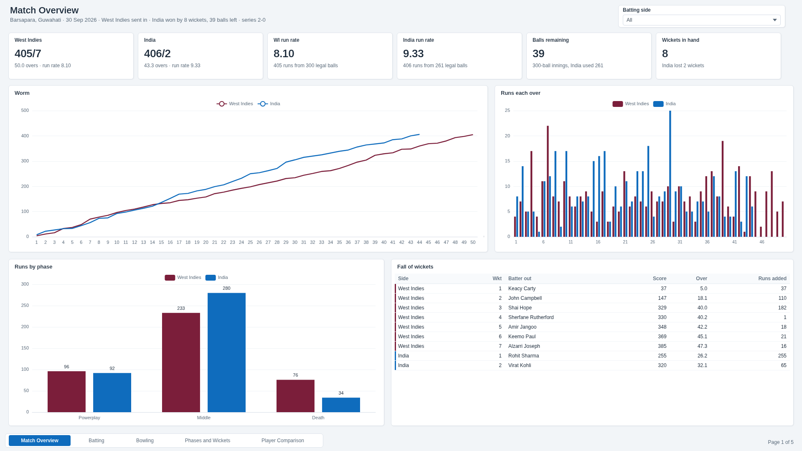
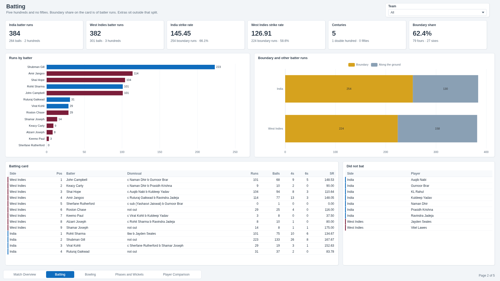
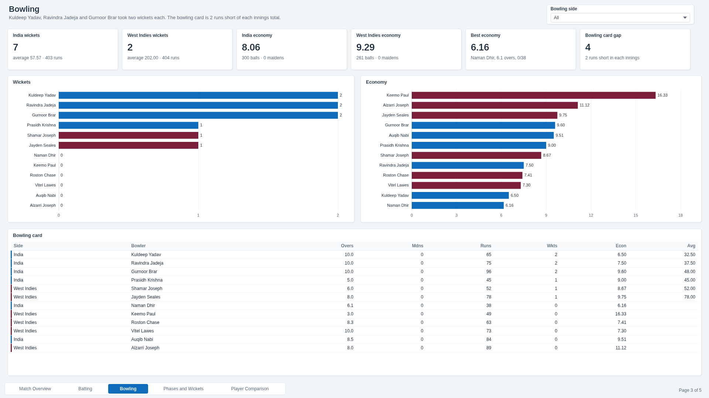
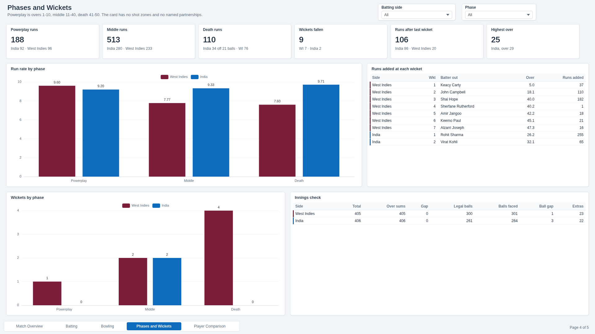
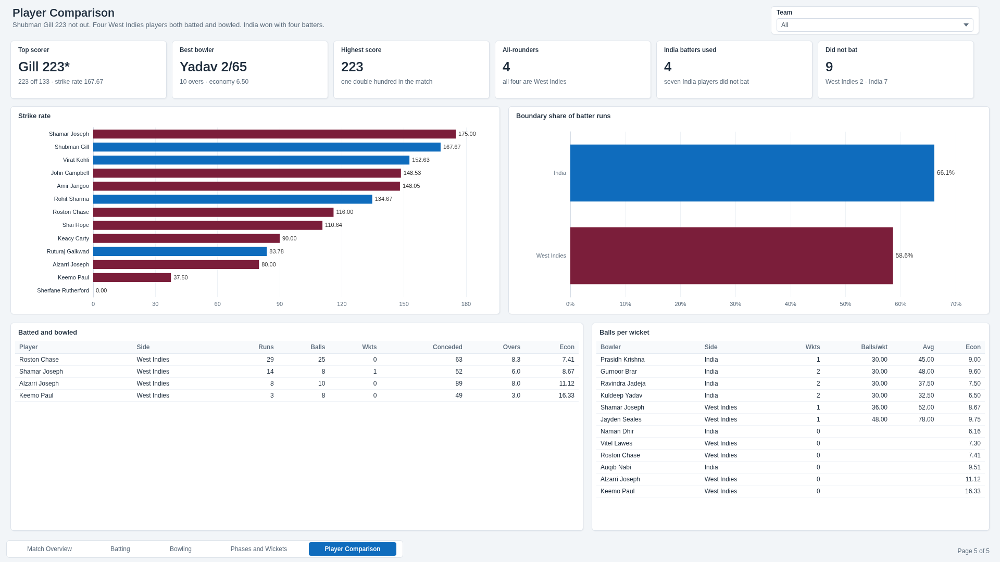

# Power BI

`IndVsWi2ndOdi.pbip` is the report for the 2nd ODI. The semantic model is TMDL. It loads the CSVs in `extracts/`, which are the scorecard in `data/` plus a few columns that are arithmetic on those files: legal balls from the published overs figure, wickets in each over from the cumulative, ODI phase bands, runs added between fall-of-wicket scores, and the players who appear on both the batting and bowling cards.

[Dashboard walkthrough (40 s)](./dashboard-walkthrough.mp4)

## Business questions

- Did India chase 406 inside 50 overs, and how many balls and wickets were left?
- Who scored the runs, how fast, and how much of it was boundaries?
- Who took the wickets, and who was economical?
- Where in the innings did the rate and the wickets change?
- Who both batted and bowled, and how many batters did India need?

## Dashboard pages

| | |
| --- | --- |
| **1. Match Overview**: 405/7 and 406/2, run rates 8.10 and 9.33, 39 balls left, 8 wickets in hand, the worm, runs each over, runs by phase, fall of wickets  | **2. Batting**: batter runs and strike rate by side, centuries, boundary share, runs by batter, boundary against other batter runs, the batting card, players who did not bat  |
| **3. Bowling**: wickets and economy by side, best economy, the 4-run gap between the bowling card and the innings totals, wickets and economy by bowler, the bowling card  | **4. Phases and Wickets**: powerplay, middle and death, wickets by phase, runs added at each wicket, the check of totals against the over summaries  |
| **5. Player Comparison**: photographs of Rohit Sharma, Shubman Gill and Virat Kohli with their scores, strike rates, boundary share, the four all-rounders, balls per wicket  | |

Each page has a team slicer. Phases and Wickets also has a phase slicer. The headline cards for the two totals, the balls remaining and the wickets in hand do not move with that slicer, so the match result stays on the page.

There is no wagon-wheel page. The files have no shot direction. There is no named-partnership page. The fall-of-wicket table shows the score when each batter was out and the runs since the previous wicket. It does not name the partner.

## Key KPIs

| KPI | Value |
| --- | --- |
| West Indies | 405/7 off 50.0 overs, 300 legal balls, run rate 8.10, extras 23 |
| India | 406/2 off 43.3 overs, 261 legal balls, run rate 9.33, extras 22 |
| Margin | 8 wickets in hand, 39 balls remaining |
| Result | India won by 8 wickets (39 balls remaining). Series 2-0 |
| Batter runs | India 384 off 264 at 145.45. West Indies 382 off 301 at 126.91 |
| Boundaries | 79 fours and 27 sixes, 478 boundary runs, 62.4% of batter runs |
| By side | India 66.1% boundaries (254 of 384). West Indies 58.6% (224 of 382) |
| Hundreds | 5, including Gill's 223 not out. Fifties: 0 |
| Top scorer | Shubman Gill 223* |
| Bowling | India 7 wickets, 403 runs, economy 8.06, average 57.57. West Indies 2 wickets, 404 runs, economy 9.29, average 202.00 |
| Best bowler | Kuldeep Yadav 2/65 |
| Best economy | Naman Dhir 6.16 (at least one over) |
| Maidens | 0 |
| Phases, runs | Powerplay 188 (WI 96, Ind 92). Middle 513 (WI 233, Ind 280). Death 110 (WI 76, Ind 34) |
| Phases, run rate | WI 9.60 / 7.77 / 7.60. India 9.20 / 9.33 / 9.71 |
| Phases, wickets | WI 1, 2 and 4. India 0, 2 and 0 |
| Highest over | 25, India, over 29 |
| After the last wicket | India 86, West Indies 20 |
| All-rounders | 4, all West Indies, 54 runs and 1 wicket between them |
| Did not bat | 9 (India 7, West Indies 2) |
| Over summaries vs totals | Gap of 0. Both innings totals match the sum of the over summaries |
| Bowling card vs totals | 4 runs short, 2 in each innings |
| Balls faced vs legal balls | 4 balls more on the batting cards: West Indies 301 against 300, India 264 against 261 |

## What the pages are for

- Match Overview is the result. The worm is the cumulative score from the over summaries. The columns are the runs in each over. India stop at over 44 because that over had 3 legal balls.
- Batting is the card. Strike rate is batter runs per 100 balls faced. Boundary share uses fours and sixes only. Extras are not in the batter runs, which is why 384 plus 22 extras is 406, and 382 plus 23 extras is 405.
- Bowling is the card. Economy is runs conceded per over from the balls column, not from the decimal look of the overs figure. 6.1 overs is 37 balls.
- Phases and Wickets uses the ODI split: overs 1 to 10, 11 to 40, and 41 to 50. India's 44th over sits in the death band. Runs added on a wicket are the score minus the previous wicket, or minus zero for the first.
- Player Comparison puts Rohit, Gill and Kohli next to their scores. The photographs are from earlier events; credits are in [image-credits.md](./image-credits.md). The same page puts the batting card and the bowling card next to each other for the four names that are on both.

## Open in Power BI Desktop

1. Open `IndVsWi2ndOdi.pbip`.
2. **Transform data > Edit parameters**. Set `DataFolder` to the full path of this `extracts` folder. Power Query cannot use a relative path.
3. Refresh.

The default parameter value is `C:\ind-vs-wi-2nd-odi-dashboard\dashboards\powerbi\extracts`. Change it to the path on your machine.

## Model notes

- Tables: `Match`, `Innings`, `Team`, `Batting`, `Bowling`, `Overs`, `FallOfWickets`, `DidNotBat`, `ScoringMix`, `AllRounder`, and `_Measures`. `Match` is not related to `Team`, so the result text stays put. The other tables filter from `Team[team]`.
- `Innings[balls]` is the published overs figure read as cricket notation: 43.3 is 43 overs and 3 balls, 261 legal balls. That matches the sum of `Overs[legal_balls]`.
- Measures sit in `_Measures`, in the folders Match, Batting, Bowling, Phases and Squad. The same expressions are in `measures.dax`.
- Phase is stored on the over summary so the slicer has something to filter. It is not a separate fact.

## Data notes

These are left as they are in the source files. They are not forced to agree.

- West Indies extras are stored as 23, which is 405 minus 382 batter runs. The PTI breakdown on the same row is b 1, nb 1, w 20, which adds to 22. The one run is not resolved in the file.
- India's extras are 22, which is 406 minus 384 batter runs. The sources did not publish the bye, leg-bye, wide and no-ball split, so the file says so.
- The India bowling card adds to 403 against West Indies' 405. The West Indies bowling card adds to 404 against India's 406. Two runs an innings. Economy uses the bowling card. The innings total uses the scorecard total.
- Balls faced on the batting card are 301 and 264. Legal balls in the over summaries are 300 and 261.
